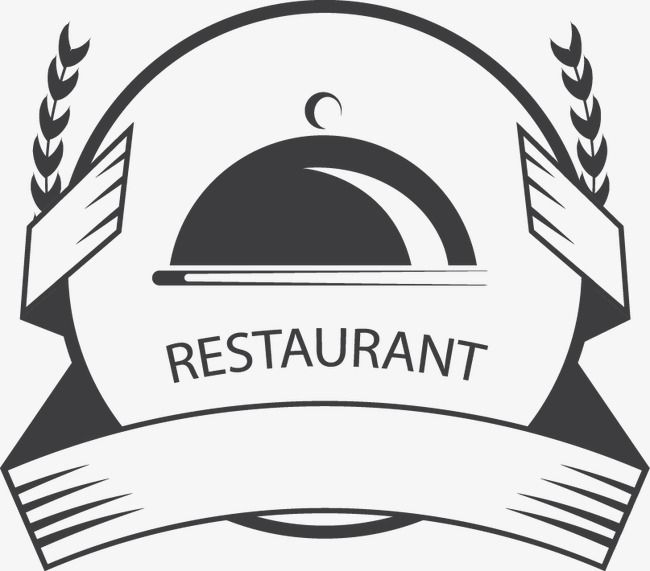

<!-- PROJECT LOGO -->
 

  

  <h3 align="center">Restaurant website project</h3>

  

    Restaurant website project using HTML and CSS and JS.
     
    <a href="https://github.com/vdfbiz7/restaurant-website-project"><strong>Explore the docs »</strong></a>
     
     
  

<!-- TABLE OF CONTENTS -->

  
Table of Contents

  <ol>
    <li>
        <a href="#built-with">Built With</a>
      <a href="#about-the-project">About The Project</a>
    </li>
  </ol>

<!-- ABOUT THE PROJECT -->

### Built With

This section should list any major frameworks/libraries used to bootstrap your project. Leave any add-ons/plugins for the acknowledgements section. Here are a few examples.

- HTML
- CSS
- Javascript

(<a href="#readme-top">back to top</a>)

## About The Project

This section should the website home, where you can directly book a table.
![RestHome][resthome-screenshot]
 
This section should the website home, where you can book a table.
![RestBook][restbook-screenshot]
 
This section should the website home, where you can see the menu.
![RestMenu][restmenu-screenshot]
 
This section should the website home, where you can see the restaurant details.
![RestRestaurant][restrestaurant-screenshot]
 
This section should the website home, where you can see the contact page.
![RestContact][restcontact-screenshot]
 
This section should the website home, where you can see the navbar.
![RestNavbar][restnavbar-screenshot]

(<a href="#readme-top">back to top</a>)

<!-- MARKDOWN LINKS & IMAGES -->
<!-- https://www.markdownguide.org/basic-syntax/#reference-style-links -->

[resthome-screenshot]: /img/res/REST_Project_HOME.png
[restbook-screenshot]: /img/res/REST_Project_BOOK.png
[restmenu-screenshot]: /img/res/REST_Project_MENU.png
[restrestaurant-screenshot]: /img/res/REST_Project_BarcelonaMap.png
[restcontact-screenshot]: /img/res/REST_Project_CONTACT.png
[restnavbar-screenshot]: /img/res/REST_Project_NAVBAR.png
